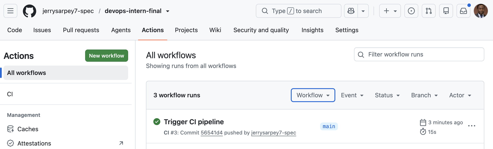
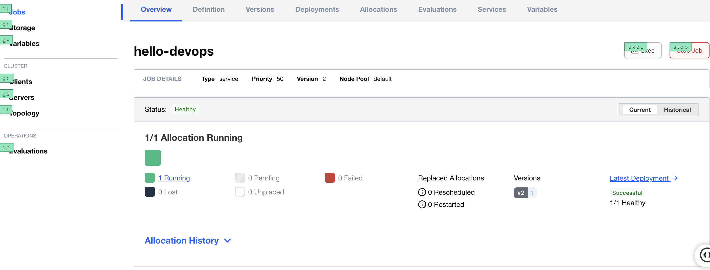
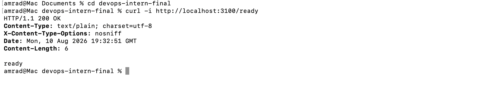

# End-to-End DevOps Automation and Observability Platform

**Candidate:** Jerry Sarpey  
**Submission date:** August 7, 2026  
**Status:** Completed

## Project Overview

This repository demonstrates a complete DevOps workflow built with Linux, GitHub Actions, Docker, HashiCorp Nomad, and Grafana Loki. It includes system automation, application containerization, continuous integration, workload orchestration, centralized logging, and supporting evidence.

## Technology Stack

| Area | Technology |
| --- | --- |
| Operating system and scripting | Linux and Bash |
| Application | Python 3.11 |
| Version control | Git and GitHub |
| Containerization | Docker |
| Continuous integration | GitHub Actions |
| Workload orchestration | HashiCorp Nomad |
| Log aggregation | Grafana Loki |

## Repository Structure

```text
devops-intern-final/
├── .github/
│   └── workflows/
│       └── ci.yml
├── images/
│   ├── cicd.png
│   ├── docker-run.png
│   ├── loki.png
│   ├── nomad.png
│   └── sysinfo.png
├── monitoring/
│   └── loki_setup.txt
├── nomad/
│   └── hello.nomad
├── scripts/
│   └── sysinfo.sh
├── Dockerfile
├── README.md
└── hello.py
```

## Prerequisites

To run the complete project locally, install:

- Git
- Python 3.11 or later
- Docker
- HashiCorp Nomad
- `curl`

## 1. Linux System Information Script

The [`scripts/sysinfo.sh`](scripts/sysinfo.sh) script displays:

- Current user
- Current date and time
- Filesystem usage
- Mounted volumes

Make the script executable and run it:

```bash
chmod +x scripts/sysinfo.sh
./scripts/sysinfo.sh
```

Example output:

```text
=== System Info ===
User: amrad
Date: Sun Aug 9 20:45:47 EDT 2026

Filesystem      Size    Used   Avail Capacity  Mounted on
...
```

## 2. Python Application

[`hello.py`](hello.py) is a lightweight Python application used as the workload throughout the CI, containerization, deployment, and monitoring stages.

Run it locally:

```bash
python3 hello.py
```

Expected output:

```text
Hello, DevOps!
```

## 3. Docker Containerization

The project uses the following minimal [`Dockerfile`](Dockerfile):

```dockerfile
FROM python:3.11-slim

WORKDIR /app
COPY . /app

CMD ["python3", "hello.py"]
```

Build the image:

```bash
docker build -t devops-hello:v1 .
```

Run the container:

```bash
docker run --rm devops-hello:v1
```

Expected output:

```text
Hello, DevOps!
```

## 4. GitHub Actions CI Pipeline

The workflow at [`.github/workflows/ci.yml`](.github/workflows/ci.yml) automatically:

1. Checks out the repository.
2. Configures the required Python version.
3. Runs the Python application.
4. Confirms that the application completes successfully.

The workflow runs whenever its configured GitHub event is triggered. To test it with a push:

```bash
git add .
git commit -m "Trigger CI pipeline"
git push
```

### Verified Result

| Item | Result |
| --- | --- |
| Workflow run | Trigger CI pipeline #3 |
| Status | Success |
| Duration | 15 seconds |



## 5. Nomad Deployment

The Nomad job specification at [`nomad/hello.nomad`](nomad/hello.nomad) defines how the containerized Python workload is scheduled and deployed.

### Job Features

- Runs the local `devops-hello:v1` Docker image
- Allocates CPU and memory resources
- Exposes port `8080`
- Captures allocation logs
- Uses the local image with `force_pull = false`

Start a local Nomad development agent in one terminal:

```bash
nomad agent -dev
```

In another terminal, submit the job:

```bash
nomad job run nomad/hello.nomad
```

Check its status:

```bash
nomad job status <job-name>
```

Verified deployment result:

```text
Healthy   = 1
Unhealthy = 0
```

View the allocations and stream the application logs:

```bash
nomad job allocs <job-name>
nomad alloc logs -f <allocation-id>
```

Expected log output:

```text
Hello, DevOps!
Hello, DevOps!
Hello, DevOps!
```



> **Note:** Nomad development mode is intended for local testing and should not be used for production workloads.

## 6. Monitoring with Grafana Loki

Grafana Loki provides centralized log aggregation and LogQL-based querying for the Docker workload. The complete setup notes are documented in [`monitoring/loki_setup.txt`](monitoring/loki_setup.txt).

### Implementation Steps

1. Started Loki as a Docker container.
2. Installed the Loki Docker logging driver.
3. Configured the application container to forward its logs to Loki.
4. Queried the collected logs with LogQL.
5. Saved the setup and validation procedure.

Start Loki:

```bash
docker run -d \
  --name loki \
  -p 3100:3100 \
  grafana/loki:2.9.2 \
  -config.file=/etc/loki/local-config.yaml
```

Install the Docker logging driver:

```bash
docker plugin install grafana/loki-docker-driver:latest \
  --alias loki \
  --grant-all-permissions
```

Run the application and forward its logs to Loki:

```bash
docker run -d \
  --name devops-hello-loki \
  --log-driver=loki \
  --log-opt loki-url="http://localhost:3100/loki/api/v1/push" \
  devops-hello:v1
```

Query the logs:

```bash
curl -G -s "http://localhost:3100/loki/api/v1/query_range" \
  --data-urlencode 'query={container_name="devops-hello-loki"}' \
  --data-urlencode 'limit=20'
```

Expected application messages:

```text
Hello, DevOps!
Hello, DevOps!
Hello, DevOps!
```



## Quick Start

Clone the repository and enter the project directory:

```bash
git clone <repository-url>
cd devops-intern-final
```

Run the Linux script:

```bash
chmod +x scripts/sysinfo.sh
./scripts/sysinfo.sh
```

Build and test the container:

```bash
docker build -t devops-hello:v1 .
docker run --rm devops-hello:v1
```

Start Nomad and deploy the workload:

```bash
nomad agent -dev
nomad job run nomad/hello.nomad
nomad job status <job-name>
```

Follow the [monitoring procedure](monitoring/loki_setup.txt) to start Loki and validate centralized logging.

## Validation Summary

The workflow was tested end to end with the following results:

| Component | Validation | Status |
| --- | --- | --- |
| Linux script | System information displayed successfully | Completed |
| Python application | Expected message returned | Completed |
| Docker | Image built and container ran successfully | Completed |
| GitHub Actions | CI workflow completed successfully | Completed |
| Nomad | Allocation reported healthy | Completed |
| Grafana Loki | Application logs were ingested and queried | Completed |
| Documentation | Setup steps and screenshots were added | Completed |

## Project Checklist

- [x] `README.md` with complete documentation
- [x] `scripts/sysinfo.sh`
- [x] `Dockerfile`
- [x] `.github/workflows/ci.yml`
- [x] `nomad/hello.nomad`
- [x] `monitoring/loki_setup.txt`
- [x] Docker image built and tested
- [x] CI workflow triggered and passed
- [x] Nomad job deployed and healthy
- [x] Loki logs verified
- [x] Validation screenshots added
- [x] Final deliverable completed

## Final Deliverable

This repository contains all required components for the Springer Capital DevOps Intern Final Assessment. It demonstrates practical experience with Linux scripting, Docker containerization, CI automation, Nomad orchestration, centralized logging, technical validation, and clear operational documentation.
